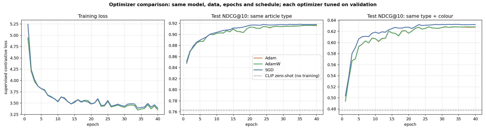

# Multimodal Product Recommendation (image + text embeddings)

Recommends products by combining **image embeddings** and **text embeddings**. It compares text-only, image-only and multimodal models, and ships a Streamlit app.

## Results (3,000 products, 66 article types, CPU)


| System | More like this<br>NDCG@10 | Same type + colour<br>NDCG@10 | Text search<br>NDCG@10 | Encode ms/item |
|---|---|---|---|---|
| TF-IDF (title) | 0.658 | 0.352 | 0.402 | 0.07 |
| MiniLM (title) | 0.733 | 0.309 | 0.607 | 9 |
| CLIP text | 0.758 | 0.518 | 0.570 | 25 |
| ResNet50 image | 0.679 | 0.257 | n/a | 166 |
| DINOv2 image | 0.758 | 0.244 | n/a | 207 |
| SigLIP image | 0.807 | 0.291 | 0.618 | 528 |
| **DINOv2 + MiniLM (late fusion)** | **0.835** | 0.332 | 0.607 | 215 |
| **CLIP image + text** | 0.815 | **0.527** | **0.625** | 171 |

All 11 systems are in [`results/model_comparison.csv`](results/model_comparison.csv).

### Verdict: which model is best?

| Task | Winner | NDCG@10 (95% CI) | Runner-up | Significant? |
|---|---|---|---|---|
| More like this (same type) | DINOv2 + MiniLM | 0.835 (0.827–0.843) | CLIP image + text, 0.815 | ✅ p < 0.001 |
| More like this (type + colour) | **CLIP image + text** | 0.527 (0.516–0.539) | CLIP text, 0.518 | ✅ p < 0.001 |
| Text search | **CLIP image + text** | 0.625 (0.589–0.660) | SigLIP image, 0.618 | ≈ tie (p = 0.72) |

**Overall winner: CLIP image + text** (mean rank 1.33 of 11 across the three tasks). Confidence intervals come from bootstrap resampling of the queries. The p-values come from a paired bootstrap test of the winner against the runner-up. The full ranking is in [`results/summary.json`](results/summary.json).

### Key findings
1. **Multimodal beats unimodal.** Each fused system scores above both of its single-modality parts on "more like this".
2. **CLIP image + text is the best all-rounder.** It is best at matching type + colour and best at text search, at moderate cost. It is the app's default.
3. **Image models barely capture colour** (strict NDCG about 0.25–0.29). Colour information mostly comes from the product title.
4. **The best fusion weight is 0.3–0.6 on the image side** (see sweep below). Using only one modality at either extreme loses accuracy.
5. **SigLIP's text tower does poorly on short product titles** (search 0.31), despite a strong image tower. It is also about 3× slower than CLIP on CPU.


**Limitations:** brand names in titles bias the text similarity toward the same brand. The relevance labels (type, colour, gender) are proxies for real user preference; there is no click or purchase data. The catalog is a 3k-item sample.

## Trained fusion model: optimizer comparison (`src/fusion.py`)

The comparison above uses pretrained models only, with no training. On top of the frozen CLIP image + text embeddings, we also train a small **fusion network** (an MLP with a residual path, 1024 → 256-d). It uses a **supervised contrastive loss** on product type and colour, plus modality dropout so it still works with text-only or image-only queries.

The optimizers are compared fairly:
1. Products are split 70/30. The 900 test products are never used for training or tuning.
2. Each optimizer gets its own learning-rate / weight-decay search on a validation split taken from the training data.
3. The tuned optimizers are retrained with **3 seeds**. Results are shown as mean ± std on the test products.

| Model (900 unseen test products) | More like this | Type + colour | Text search |
|---|---|---|---|
| CLIP image + text, zero-shot (no training) | 0.763 | 0.478 | 0.698 |
| Trained fusion, **SGD** (momentum 0.9, lr 0.05) | **0.920 ± 0.003** | **0.631 ± 0.001** | **0.809 ± 0.007** |
| Trained fusion, **Adam** (lr 0.003) | 0.919 ± 0.003 | 0.628 ± 0.001 | 0.789 ± 0.009 |
| Trained fusion, **AdamW** (lr 0.003, wd 0.05) | 0.919 ± 0.003 | 0.628 ± 0.000 | 0.788 ± 0.010 |



**Findings:** training lifts every metric by roughly 0.15 NDCG. The choice of optimizer matters much less: SGD is slightly better on text search (about 2 std), and all three are tied on "more like this". Adam and AdamW are almost identical, because decoupled weight decay has little effect over 40 short epochs.

## Conditional GAN (`src/gan.py`)

A **conditional DCGAN** generates new 64×64 product images for a chosen category. The app then retrieves the most similar real products, as a "design a new product" demo.
* Generator: noise + category embedding → transposed convolutions. Discriminator: spectral norm, minibatch-std feature and projection conditioning. Loss: hinge.
* Optimizer: **Adam with TTUR** (discriminator lr 4e-4, generator lr 1e-4, betas 0.0/0.9).
* **DiffAugment** is applied to real and fake images. Without it, the first training run **mode-collapsed**: every sample within a category was identical, because the discriminator memorised the 2.7k photos.
* Evaluation, measured in CLIP space: **FD-CLIP** (Fréchet distance to real images, lower is better) and **class accuracy**, where a classifier trained on real photos checks whether generated images look like the requested category. See `results/gan_metrics.json`.

## Internet and REST API

* **REST API** (`api.py`, FastAPI): `python -m uvicorn api:app --port 8000`. Interactive docs are at http://localhost:8000/docs. It provides recommend, text search, image upload, image URL, live-shop search and GAN generation. See the docstring in `api.py` for the full endpoint list.
* **Image from URL** (`src/web.py`): search using any product photo on the web. Only http(s) links are accepted. Private and local network addresses are refused, including via redirects, and downloads are capped at 10 MB.
* **Live shop catalog** (`src/live.py`): products are fetched from the public **dummyjson.com** API and embedded with CLIP. You can then search them, or match them against our fashion catalog: `python -m src.live`, or the 🌐 tab in the app.

## Pipeline

```
catalog (image + title)  ─┬─ image encoder ─► I  (N × d_i, L2-normalised)
                          └─ text encoder  ─► T  (N × d_t, L2-normalised)

score(query, item) = w · cos(q_img, I_item) + (1 − w) · cos(q_txt, T_item)
```

* **Late fusion**: `w` is the image weight. `w = 1` means image only and `w = 0` means text only.
* **Shared space (CLIP / SigLIP)**: images and text are embedded into the same space. A *text* query can therefore be matched against product *images* (zero-shot visual search). An image and a text modifier can also be added together into one composed query, such as "this shoe, but in red".

## Models compared

| Group | System | Encoder(s) |
|---|---|---|
| text | TF-IDF (title) | word + bigram TF-IDF, lexical baseline |
| text | MiniLM (title) | `sentence-transformers/all-MiniLM-L6-v2` |
| text | CLIP text / SigLIP text | text tower of the VLM |
| image | ResNet50 image | torchvision ImageNet ResNet-50 (supervised CNN) |
| image | DINOv2 image | `facebook/dinov2-small` (self-supervised ViT) |
| image | CLIP image / SigLIP image | image tower of the VLM |
| multimodal | DINOv2 + MiniLM | late fusion of two separate unimodal models |
| multimodal | CLIP image + text | `openai/clip-vit-base-patch32` |
| multimodal | SigLIP image + text | `google/siglip-base-patch16-224` |

## Evaluation (`src/evaluate.py`)

* **Item-to-item ("more like this")**: every product is used as a query.
  * *i2i*: a result is relevant if it has the same `articleType`.
  * *i2i-strict*: a result is relevant only if it has the same `articleType` **and** `baseColour`.
* **Text search**: shopper-style queries built from metadata, for example *"navy blue shirts for men"*. A result is relevant if its colour, type and gender all match the query.
* Metrics: P@5, P@10, mAP@10 and NDCG@10. The evaluation also records encoding speed (ms/item) and runs a sweep over the fusion weight `w`.

Only the product **title** is embedded as text. Category and colour columns are kept out of the text because they are the evaluation labels, so including them would leak the answers.

## Run

```bash
pip install -r requirements.txt
python -m src.data          # download 3,000 products (images + metadata)
python -m src.embeddings    # embed catalog with all models (~1 h on an 8-core CPU, minutes on a GPU)
python -m src.evaluate      # comparison table, significance tests + charts -> results/
python -m src.fusion        # train fusion heads with SGD / Adam / AdamW (~6 min on CPU)
python -m src.gan           # train the conditional GAN (~35 min on CPU; faster on a GPU / Colab)
python -m src.live          # fetch the live shop catalog from dummyjson.com (needs internet)
python -m streamlit run app.py   # the application -> http://localhost:8501
python -m uvicorn api:app --port 8000   # the REST API -> http://localhost:8000/docs
python -m pytest -q         # tests: metrics, fusion, all 11 systems, the Streamlit app
```

`notebook.ipynb` walks through the whole pipeline with figures: dataset, models, examples, evaluation, t-SNE of the embedding space, zero-shot search and composed queries.

Change `N_PRODUCTS` in `src/config.py` to use a bigger catalog. The full dataset has about 44k products, which is practical on a GPU.

## App features

* **Model comparison** (first tab): the winner banner, per-task winner cards with confidence intervals and significance, the overall ranking, detailed metrics, charts and a side-by-side view of models on one product.
* **More like this**: pick a catalog product and get similar products.
* **Text search**: free-text queries.
* **Image search**: upload a photo and find visually similar products.
* **Image + text**: a composed query made from a reference image plus a text modifier.
* **Internet**: search with an image URL; fetch and search a live shop catalog; match live products to ours.
* **GAN**: generate new product designs per category and find similar real products.
* Sidebar: model selector, image/text fusion slider, and gender/category filters.

## Project layout

```
src/config.py        paths & settings
src/data.py          dataset download -> data/catalog.csv + data/images/
src/encoders.py      TF-IDF, MiniLM, ResNet50, DINOv2, CLIP, SigLIP behind one API
src/embeddings.py    compute + cache embeddings -> embeddings/*.npy
src/recommender.py   systems (image model, text model) + weighted fusion scoring
src/evaluate.py      offline comparison, CIs + significance tests -> results/
src/fusion.py        trained fusion head + SGD / Adam / AdamW comparison
src/gan.py           conditional DCGAN (DiffAugment, TTUR) + FD-CLIP evaluation
src/query.py         query encoding shared by app, API and tests
src/web.py           safe image download from URLs
src/live.py          live product catalog from the dummyjson.com API
app.py               Streamlit application
api.py               REST API (FastAPI)
notebook.ipynb       end-to-end walkthrough with figures
tests/               pytest suite: metrics, all systems, trained heads, GAN, URL safety, REST API, app
```
