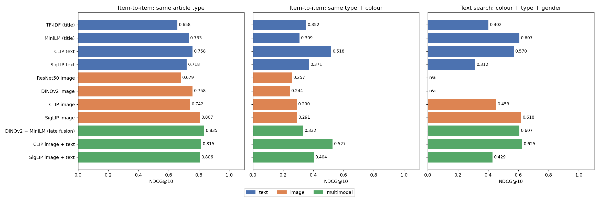
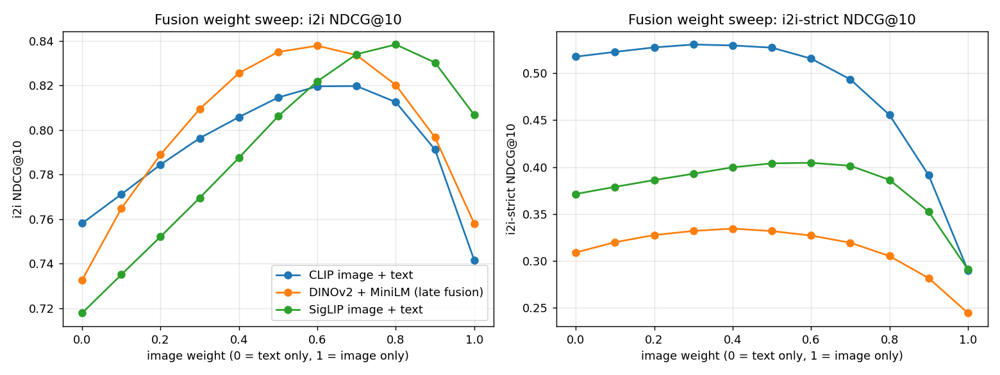

# Multimodal Product Recommendation (image + text embeddings)

Recommends products by combining **image embeddings** and **text embeddings**. It compares text-only, image-only and multimodal models, and ships a Streamlit app.

## Results (3,000 products, 66 article types, CPU)



| System | More like this<br>NDCG@10 | Same type + colour<br>NDCG@10 | Text search<br>NDCG@10 | Encode ms/item |
|---|---|---|---|---|
| TF-IDF (title) | 0.658 | 0.352 | 0.402 | 0.07 |
| MiniLM (title) | 0.733 | 0.309 | 0.607 | 9 |
| CLIP text | 0.758 | 0.518 | 0.570 | 25 |
| ResNet50 image | 0.679 | 0.257 | n/a | 166 |
| DINOv2 image | 0.758 | 0.244 | n/a | 207 |
| SigLIP image | 0.807 | 0.291 | 0.618 | 528 |
| **DINOv2 + MiniLM (late fusion)** | **0.835** | 0.332 | 0.607 | 215 |
| **CLIP image + text** | 0.815 | **0.527** | **0.625** | 171 |

All 11 systems are in [`results/model_comparison.csv`](results/model_comparison.csv).

### Key findings
1. **Multimodal beats unimodal.** Each fused system scores above both of its single-modality parts on "more like this".
2. **CLIP image + text is the best all-rounder.** It is best at matching type + colour and best at text search, at moderate cost. It is the app's default.
3. **Image models barely capture colour** (strict NDCG about 0.25–0.29). Colour information mostly comes from the product title.
4. **The best fusion weight is 0.3–0.6 on the image side** (see sweep below). Using only one modality at either extreme loses accuracy.
5. **SigLIP's text tower does poorly on short product titles** (search 0.31), despite a strong image tower. It is also about 3× slower than CLIP on CPU.



**Limitations:** brand names in titles bias the text similarity toward the same brand. The relevance labels (type, colour, gender) are proxies for real user preference; there is no click or purchase data. The catalog is a 3k-item sample.

## Pipeline

```
catalog (image + title)  ─┬─ image encoder ─► I  (N × d_i, L2-normalised)
                          └─ text encoder  ─► T  (N × d_t, L2-normalised)

score(query, item) = w · cos(q_img, I_item) + (1 − w) · cos(q_txt, T_item)
```

* **Late fusion**: `w` is the image weight. `w = 1` means image only and `w = 0` means text only.
* **Shared space (CLIP / SigLIP)**: images and text are embedded into the same space. A *text* query can therefore be matched against product *images* (zero-shot visual search). An image and a text modifier can also be added together into one composed query, such as "this shoe, but in red".

## Models compared

| Group | System | Encoder(s) |
|---|---|---|
| text | TF-IDF (title) | word + bigram TF-IDF, lexical baseline |
| text | MiniLM (title) | `sentence-transformers/all-MiniLM-L6-v2` |
| text | CLIP text / SigLIP text | text tower of the VLM |
| image | ResNet50 image | torchvision ImageNet ResNet-50 (supervised CNN) |
| image | DINOv2 image | `facebook/dinov2-small` (self-supervised ViT) |
| image | CLIP image / SigLIP image | image tower of the VLM |
| multimodal | DINOv2 + MiniLM | late fusion of two separate unimodal models |
| multimodal | CLIP image + text | `openai/clip-vit-base-patch32` |
| multimodal | SigLIP image + text | `google/siglip-base-patch16-224` |

## Evaluation (`src/evaluate.py`)

* **Item-to-item ("more like this")**: every product is used as a query.
  * *i2i*: a result is relevant if it has the same `articleType`.
  * *i2i-strict*: a result is relevant only if it has the same `articleType` **and** `baseColour`.
* **Text search**: shopper-style queries built from metadata, for example *"navy blue shirts for men"*. A result is relevant if its colour, type and gender all match the query.
* Metrics: P@5, P@10, mAP@10 and NDCG@10. The evaluation also records encoding speed (ms/item) and runs a sweep over the fusion weight `w`.

Only the product **title** is embedded as text. Category and colour columns are kept out of the text because they are the evaluation labels, so including them would leak the answers.

## Run

```bash
pip install -r requirements.txt
python -m src.data          # download 3,000 products (images + metadata)
python -m src.embeddings    # embed catalog with all models (~10 min on CPU)
python -m src.evaluate      # comparison table + charts -> results/
streamlit run app.py        # the application
```

Change `N_PRODUCTS` in `src/config.py` to use a bigger catalog. The full dataset has about 44k products, which is practical on a GPU.

## App features

* **More like this**: pick a catalog product and get similar products.
* **Text search**: free-text queries.
* **Image search**: upload a photo and find visually similar products.
* **Image + text**: a composed query made from a reference image plus a text modifier.
* **Model comparison**: the metrics table, charts and a side-by-side view of different models on one product.
* Sidebar: model selector, image/text fusion slider, and gender/category filters.

## Project layout

```
src/config.py        paths & settings
src/data.py          dataset download -> data/catalog.csv + data/images/
src/encoders.py      TF-IDF, MiniLM, ResNet50, DINOv2, CLIP, SigLIP behind one API
src/embeddings.py    compute + cache embeddings -> embeddings/*.npy
src/recommender.py   systems (image model, text model) + weighted fusion scoring
src/evaluate.py      offline comparison -> results/
app.py               Streamlit application
```
